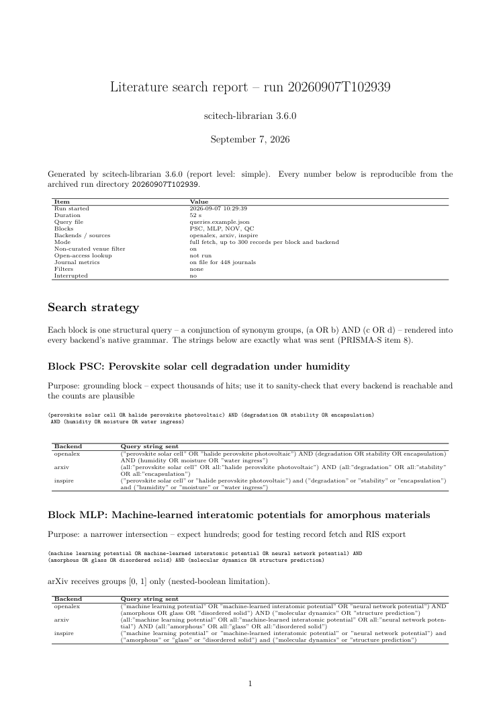
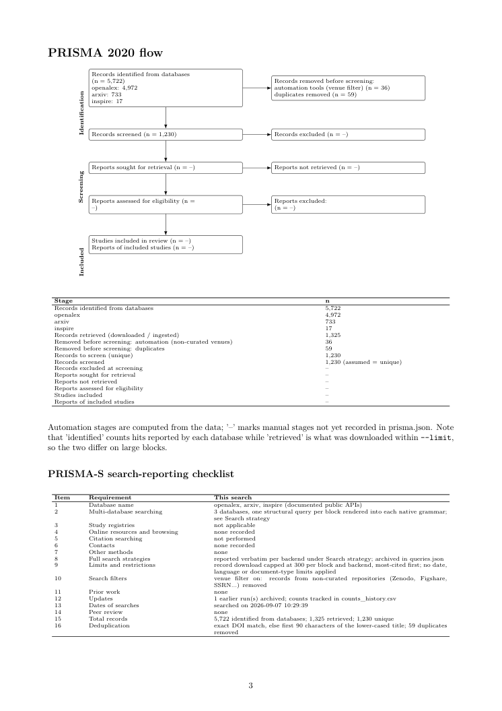
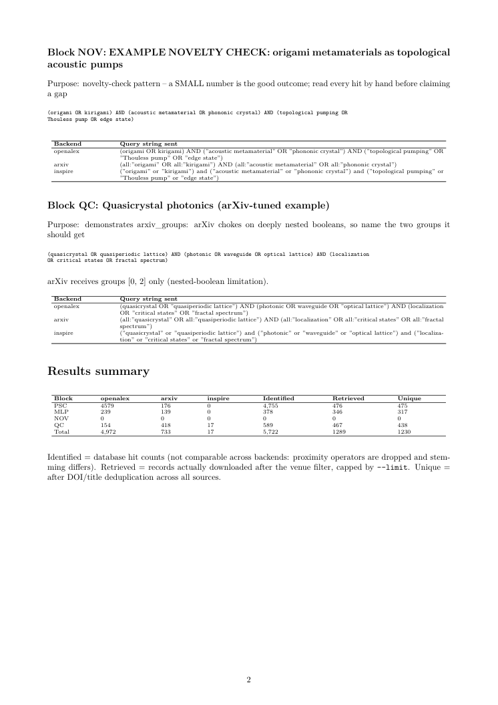
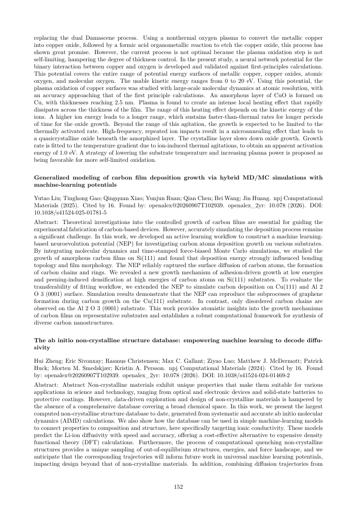
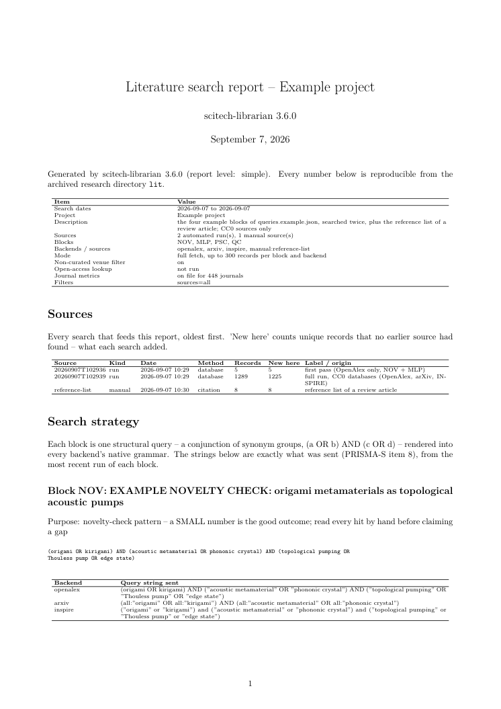
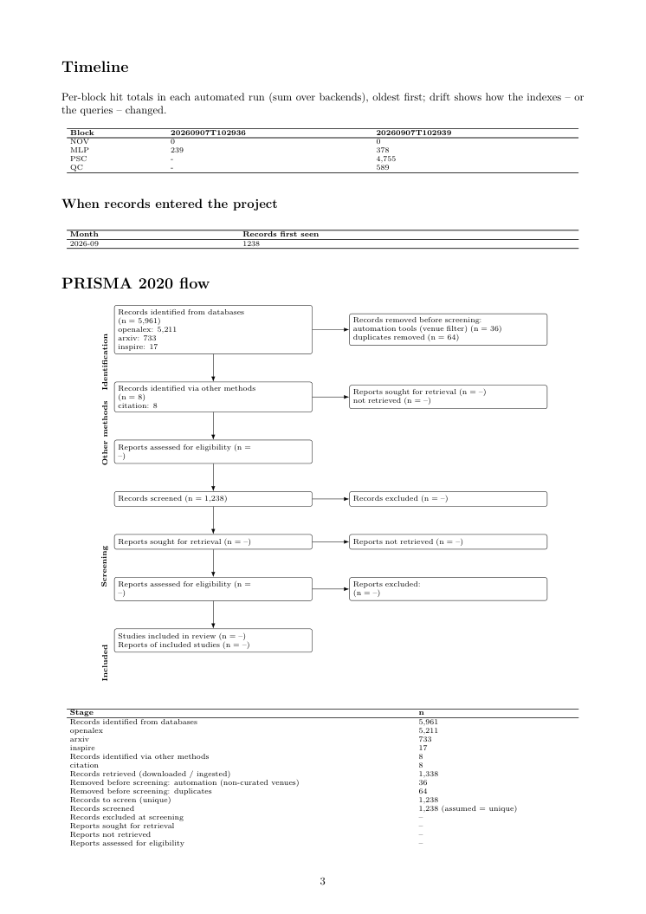

# scitech-librarian
<!-- source-digest: 44343a37e1c07e63 -->

[](https://github.com/fabiocampolim-design/scitech-librarian/actions/workflows/tests.yml)
[](https://www.python.org/)
[](librarian.py)
[](#hält-sich-an-die-regeln)
[](LICENSE)

[English](README.md) · [Português (Brasil)](README.pt-BR.md) · [Español](README.es.md) · **Deutsch** · [Français](README.fr.md)

*Übersetzung der englischen README, die maßgeblich bleibt; Befehle, Dateinamen, Optionen und Codeblöcke sind unverändert übernommen.*

**Eine Abfrage, jede wissenschaftliche Datenbank — und ein
Forschungsverzeichnis, das sich an jede Suche und jeden von Hand
eingebrachten Datensatz erinnert und den PRISMA-Bericht für alles schreibt.**

Schreiben Sie eine strukturierte Abfrage einmal; scitech-librarian überträgt
sie in die native Syntax von neun bibliografischen Datenbanken (OpenAlex, NASA
ADS, arXiv, INSPIRE-HEP, Scopus, Semantic Scholar, Crossref, CORE, Web of Science),
führt sie alle aus und archiviert den Lauf — Rohdatensätze, RIS für Zotero,
den exakten an jedes Backend gesendeten Abfragestring, Trefferzahlen — in
einem zeitgestempelten Verzeichnis, das Sie zitieren können. Läufe sammeln
sich in einem **Forschungsverzeichnis**: ein Ordner pro Projekt, der auch
außerhalb des Werkzeugs beschaffte Datensätze aufnimmt (Exporte aus Zotero,
Mendeley und Web of Science, die RIS-Datei einer Kollegin, eine
Literaturliste) samt ihrer Herkunft, Zeitschriftenkennzahlen Jahr für Jahr
führt und einen **Literaturrecherche-Bericht** erzeugt — Suchstrategie,
Ergebnisse, **PRISMA-2020-Flussdiagramm und PRISMA-S-Checkliste**,
Zeitverlauf, was jede Suche beigetragen hat, Zeitschriftenkennzahlen,
Vorschläge — für einen Lauf oder das ganze Projekt, gefiltert nach Datum,
Quelle, Datenbank, Jahr, Zitationen oder Zeitschriftenqualität, als Markdown,
HTML, LaTeX, PDF oder reiner Text in drei Detailstufen. Ein Labor führt ein
Verzeichnis pro Projekt. Datenbanken sind **Konfiguration, kein Code**.

Nur Standardbibliothek, kein Installationsschritt: fünf Skripte —
`librarian.py` (Suche), `project.py` (Forschungsverzeichnis und Import),
`report.py` (Berichte), `journals.py` (Zeitschriftenkennzahlen),
`wos_manual.py` (Web of Science von Hand) — plus `render.py`, der gemeinsame
Markdown/HTML/LaTeX/PDF-Renderer, und `i18n.py`, der Sprachkatalog der
Berichte. Vollständige Dokumentation: [**Benutzerhandbuch**](docs/USER_MANUAL.de.md)
([HTML](docs/USER_MANUAL.de.html) · [PDF](docs/USER_MANUAL.de.pdf); englisches Original:
[User Manual](docs/USER_MANUAL.md), [HTML](docs/USER_MANUAL.html) · [PDF](docs/USER_MANUAL.pdf));
eine [**Schritt-für-Schritt-Anleitung**](docs/WALKTHROUGH.md) (englisch)
eines realen Projekts von Anfang bis PRISMA führt jede Funktion vor;
[JCR import](docs/JCR_IMPORT.md) behandelt den lizenzierten Impact Factor.
Arbeiten Sie mit einem KI-Agenten? Geben Sie ihm [**AGENTS.md**](AGENTS.md)
— die vollständigen maschinenorientierten Anweisungen — und sagen Sie *"lies
AGENTS.md und führe dann eine Neuheitsprüfung zu X durch"*.

```bash
python librarian.py --selftest                       # ping every backend; report what works
python librarian.py --counts-only                    # fast: hit counts for every query block
python librarian.py --pdfs                           # full run + legal open-access PDF lookup
python project.py ingest export.ris --name zotero --method citation   # records from outside
python report.py --project --since 2026-06-01 --diff # what the searches since June added
python journals.py fetch                             # venue metrics (OpenAlex, no key)
```

> **Rückmeldungen sind sehr willkommen.** Wenn sich eine Datenbank
> fehlverhält, eine Trefferzahl falsch aussieht oder Sie einen
> `backends.json`-Eintrag für eine Datenbank geschrieben haben, die wir nicht
> mitliefern, bitte
> [ein Issue eröffnen](https://github.com/fabiocampolim-design/scitech-librarian/issues) —
> Konfigurationseinträge für neue Datenbanken sind besonders willkommen.

**Warum es das gibt.** Eine Literaturrecherche, die Sie nicht wiederholen
können, ist eine Behauptung, die Sie nicht verteidigen können. Systematische
Reviews und Neuheitsprüfungen („niemand hat X gemacht") hängen davon ab,
genau welche Datenbanken Sie mit genau welcher Abfrage an genau welchem Tag
befragt haben — und genau diese Aufzeichnung überlebt fast nie. Dieses
Werkzeug wurde für die Neuheitsprüfungen einer Physik-Promotion gebaut und
bewahrt diese Aufzeichnung konstruktionsbedingt: jeder Lauf archiviert seine
Abfragen, Trefferzahlen und Datensätze, sodass die Suche sechs Monate später
reproduzierbar und die Drift der Trefferzahlen sichtbar ist.

## Hält sich an die Regeln

Dieses Werkzeug nimmt die Nutzungsbedingungen jeder Datenbank, die es
berührt, ernst — nicht als Kleingedrucktes, sondern als Konstruktionsprinzip:

- **Nur dokumentierte öffentliche APIs.** Es scrapt nie eine
  Web-Oberfläche. Das Scrapen von Web of Science oder Scopus verletzt deren
  Bedingungen und kann den Zugang Ihrer gesamten Institution sperren lassen.
- **Web of Science ohne API-Lizenz ist Handarbeit, also haben wir die
  Handarbeit klein gemacht** — `wos_manual.py` bereitet jede Abfrage in der
  WoS-eigenen Grammatik vor, führt Sie durch das Einfügen in die offizielle
  Oberfläche und importiert Ihre RIS-Exporte zurück in dasselbe
  Datensatzschema. Einfügen, exportieren, fertig.
- **Kein Google Scholar.** Es hat keine API, und es zu scrapen verletzt seine
  Bedingungen.
- **Ratenlimits werden eingehalten** — Pausen pro Backend (einschließlich der
  von arXiv erbetenen ≥3 s zwischen Aufrufen) und eine Kontakt-E-Mail im
  User-Agent, was Sie zudem in den schnelleren „polite pool" von
  OpenAlex/Crossref bringt.
- **PDFs nur über Unpaywall** — legale Open-Access-Kopien, nie die Umgehung
  von Bezahlschranken.
- **Zugangsberechtigungen werden respektiert, nicht umgangen** —
  Scopus-Ergebnisse kommen über das Abonnement Ihrer Institution
  (Campusnetz oder VPN), und die README dokumentiert, wie dieser Zugang
  tatsächlich funktioniert.

## Funktionen

- **Eine strukturelle Abfrage, neun native Grammatiken.** `[[a, b], [c]]`
  bedeutet `(a OR b) AND c`; die Syntax jedes Backends —
  `TITLE-ABS-KEY(...)`, `TS=(...)`, `abs:"..."`, kleingeschriebenes `and` —
  wird aus derselben Definition erzeugt, sodass Abfragen zwischen Datenbanken
  nie auseinanderlaufen.
- **Datenbanken sind Daten.** Jedes Backend ist ein JSON-Eintrag:
  Abfragegrammatik, Endpunkt, Auth-Header, Paginierungsstil und gepunktete
  Pfade in die Antwort. `--init-backends` schreibt die Voreinstellungen nach
  `backends.json`; bearbeiten Sie sie, um Datenbanken ohne Codeänderung
  hinzuzufügen, zu ändern oder abzuschalten. Nur Engines, die wirklich Code
  brauchen (der XML-Feed von arXiv), nutzen einen kleinen Treiber.
- **Alles wird archiviert.** Jeder Lauf schreibt ein zeitgestempeltes
  Verzeichnis mit rohen JSON-Datensätzen, RIS pro Block, einem deduplizierten
  Gesamtbestand als CSV/RIS/JSON/BibTeX/CSL-JSON, dem exakten an jedes
  Backend gesendeten Abfragestring, Trefferzahlen als JSON und als
  einfügefertige Markdown-Tabelle, Laufmetadaten und einem vollständigen Log.
  Trefferzahlen werden zusätzlich an eine Verlaufsdatei angehängt, sodass die
  Drift über die Zeit sichtbar ist.
- **Ein Forschungsverzeichnis, kein Haufen von Läufen.** `project.py`
  indexiert jeden Lauf und jeden von außen eingebrachten Datensatz (RIS,
  BibTeX, CSV, JSON — Zotero, Mendeley, Web of Science, Literaturlisten; ein
  Eingangsordner für Mitarbeitende), bewahrt die Herkunft (wer, wann, woher,
  PRISMA-Methode), führt alles mit `found_by` / `first_seen` pro Datensatz
  zusammen, und `report.py --project` beschreibt das ganze Projekt: was jede
  Suche beigetragen hat, welche Datenbank gefunden hat, was keine andere
  fand, Drift der Trefferzahlen über die Zeit und ein PRISMA-Fluss mit beiden
  Identifikationsspalten. Filter nach Datumsfenster, Differenz („neu seit
  Juni"), Quellenart, Datenbank, Block, Erscheinungsjahr, Zitationen,
  Zeitschriftenkennzahl. Ein Verzeichnis pro Projekt; ein Labor hat mehrere.
- **Zeitschriftenkennzahlen, Jahr für Jahr.** `journals.py` holt die
  mittlere 2-Jahres-Zitiertheit von OpenAlex (ohne Schlüssel) und
  CiteScore/SJR/SNIP von Scopus (Schlüssel), importiert SCImago-CSVs und
  lizenzierte JCR-Exporte, speichert Werte pro Jahr, sodass sich die Reihe
  aufbaut, und speist eine Kennzahlspalte, eine Tabelle der Zeitschriften
  nach Kennzahl, eine Entwicklungstabelle und `--min-metric` in die Berichte.
- **Logs und Audits.** Jedes Skript schreibt ein Audit-Log (Aufruf,
  Versionen, jede Warnung) unter `<outdir>/logs/`; die Konsolenausgabe ist
  standardmäßig knapp, `--verbose` / `--quiet` / `--log-dir` / `--outdir`
  bei allen; `--help` listet jeden Parameter mit seiner Voreinstellung.
- **Ein Literaturrecherche-Bericht, PRISMA inklusive.** Jeder Lauf endet mit
  `report.md` (oder HTML / LaTeX / PDF / reiner Text): die Suchstrategie mit
  dem exakten an jede Datenbank gesendeten String, eine Ergebniszusammenfassung,
  ein **PRISMA-2020-Flussdiagramm**, dessen automatisierbare Stufen aus dem
  Lauf befüllt werden, eine **PRISMA-S**-Checkliste zur Suchberichterstattung,
  die Top-Datensätze pro Block und regelbasierte Vorschläge (diesen Block
  verschärfen, jenes Backend erneut ausführen, das Limit erhöhen, diese fünf
  Treffer von Hand lesen). Drei Stufen — `simple`, `intermediate`, `full` —
  von einer zweiseitigen Zusammenfassung bis zu jedem Datensatz mit Abstract
  und vollständigem Log. Siehe [Berichte und PRISMA](#berichte-und-prisma).
- **Berichte in fünf Sprachen.** `--lang pt-BR|es|de|fr` (Standard `en`)
  schreibt den berichtseigenen Text — Überschriften, PRISMA-Stufen und
  -Diagramm, Checkliste, Erläuterungen, Vorschläge — auf brasilianischem
  Portugiesisch, Spanisch, Deutsch oder Französisch. Datensätze,
  Abfragestrings, Blocknamen, Dateinamen und Logs werden nie übersetzt: ein
  Bericht bleibt in jeder Sprache eine getreue Aufzeichnung der Suche.
- **Absturzsicher durch Checkpoints.** Trefferzahlen werden nach *jedem*
  API-Aufruf gespeichert und Strg-C ist sicher — ein Hänger spät in einem
  langen Lauf verliert nichts.
- **Ein Schrottfilter mit Belegen.** OpenAlex indexiert nicht kuratierte
  Repositorien; in einem Lauf mit 5.146 Datensätzen kamen 15,3 % seiner
  Datensätze von Zenodo, SSRN, Figshare und dergleichen — gegenüber 0 % bei
  ADS, Scopus, Semantic Scholar und INSPIRE. Bei einer entscheidenden
  Neuheitsabfrage war das der ganze Unterschied zwischen 16 Treffern und 3.
  Standardmäßig gefiltert; `--keep-junk` schaltet es ab.
- **Funktioniert ganz ohne Zugehörigkeit.** Sechs Backends brauchen weder
  Schlüssel noch Institution; ADS braucht nur ein kostenloses persönliches
  Token. Kein VPN, kein Campusnetz, kein Abonnement — das zählt nur, wenn Sie
  Scopus oder die WoS-API obendrauf setzen.
- **Physik wird erstklassig abgedeckt.** NASA ADS und INSPIRE-HEP sind
  Backends, die kein vergleichbares Werkzeug mitbringt; für begutachtete
  Physik ist ADS im Wesentlichen vollständig.
- **Neuheitsprüfungen als Arbeitsablauf.** Entwerfen Sie Blöcke so, dass eine
  *kleine* Zahl das informative Ergebnis ist, lassen Sie dieselben Blöcke
  über die Zeit laufen, beobachten Sie die Trefferzahlen — und lesen Sie
  jeden Treffer von Hand, bevor Sie eine Lücke behaupten.
- **Offline testbar.** 325 Prüfungen laufen ohne Netz und ohne Schlüssel
  (Backends werden gegen aufgezeichnete API-Antworten geprüft; das
  Forschungsverzeichnis, die Import-Parser, der Zeitschriftenspeicher und
  der Berichtsgenerator gegen synthetische Verzeichnisse); CI auf Linux,
  Windows und macOS, Python 3.9 und 3.13.

## Die Datenbanken: wofür jede wirklich taugt

| Datenbank | Schlüssel nötig | Abdeckung | Verwenden für | Vorsicht bei |
|---|---|---|---|---|
| **OpenAlex** | keiner | ~250 Mio. Werke, inkl. Preprints | erster Durchgang, funktioniert immer, keine Institution nötig | ~15 % nicht kuratierter Schrott — standardmäßig gefiltert |
| **NASA ADS** | kostenloses Token | vollständige begutachtete Physik + Astronomie, arXiv eingebunden | **beste Einzelquelle für Physik** | nichts Ernstes |
| **arXiv** | keiner | Preprints, alle Fächer | brandneue Arbeiten | verschluckt sich an verschachtelten Booleans — siehe Fallstricke |
| **INSPIRE-HEP** | keiner | HEP, Gitter-QCD, Teilchentheorie | für allgemeine Indizes unsichtbare Literatur | enger Fachbereich |
| **Scopus** | kostenloser Schlüssel + Institution | ~27–28 Tsd. kuratierte Zeitschriften | zitierfähige Trefferzahlen für Aufsätze | Berechtigung ist IP-basiert; braucht Campusnetz oder VPN |
| **Semantic Scholar** | keiner | breit, guter Zitationsgraph | Gegenprüfung | ~1 Anfrage/s ohne Schlüssel |
| **Crossref** | keiner | DOI-Metadaten für ~150 Mio. Objekte | DOIs auflösen | **keine Boolean-Unterstützung** — Trefferzahlen bedeutungslos, aus Standardläufen ausgeschlossen |
| **CORE** | keiner (ein Schlüssel erhöht das Ratenlimit) | ~300 Mio. Open-Access-Objekte aus ~10 000 Repositorien | Dissertationen, technische Berichte, institutionelle Ablagen — graue Literatur, die kein Zeitschriftenindex führt | viele Datensätze haben weder DOI noch Zeitschrift |
| **Web of Science** | lizenziert | ~21–22 Tsd. kuratierte Zeitschriften | konventionelle Legitimität | API meist nicht lizenziert — `wos_manual.py` nutzen |

**Wenn Sie nur zwei einrichten:** OpenAlex (funktioniert sofort) und NASA ADS
(kostenloses Token in 30 Sekunden). Nehmen Sie Scopus hinzu, wenn Sie
zitierfähige Trefferzahlen für einen Aufsatz brauchen. **Realitätsprüfung
der Abdeckung:** Scopus indexiert ~25–30 % mehr Zeitschriften als WoS, und
80–85 % der WoS-Zeitschriften sind auch in Scopus; für Physik ist ADS im
Wesentlichen vollständig — also ist Scopus + ADS + arXiv in der Praxis eine
Obermenge von WoS.

## Die Schlüssel beschaffen

Das Werkzeug liest seine Schlüssel aus der Prozessumgebung. Zwei Wege bringen
sie dorthin, und Sie können sie mischen:

- **Eine `.env`-Datei** — kopieren Sie `.env.example` nach `.env` und füllen
  Sie sie aus; das Skript liest sie automatisch, keine Shell-Variablen zu
  setzen. Sie wird von git ignoriert.
- **Umgebungsvariablen** — exportieren Sie sie aus Ihrer Shell, setzen Sie sie
  in der Konfiguration Ihres Agenten oder Starters, oder liefern Sie sie als
  CI-Secrets. Diese haben Vorrang: `.env` füllt nur, was noch nicht gesetzt
  ist, sodass Sie auf diesem Weg nie eine `.env` brauchen.

So oder so zeigt `python librarian.py --list`, welche Schlüssel angekommen
sind, und `--selftest` beweist, dass sie funktionieren.

- **NASA ADS** — <https://ui.adsabs.harvard.edu/user/settings/token>.
  Anmelden, erzeugen, einfügen. Höchster Wert pro aufgewendeter Minute.
- **Scopus / Elsevier** — <https://dev.elsevier.com/apikey/manage>.
  Kostenlos, sofort. Der Schlüssel authentifiziert *Sie*; die Berechtigung
  kommt aus dem Abonnement Ihrer Institution, also im Campusnetz oder VPN
  sein (ein 401/403 bedeutet meist ein Netzproblem, keinen schlechten
  Schlüssel). **Elsevier hat keinen Widerrufsknopf** — ein geleakter
  Schlüssel ist verbrannt, nicht deaktiviert. Optional bei Ihrer Bibliothek
  ein InstToken erbitten, das die VPN-Abhängigkeit aufhebt.
- **Semantic Scholar** — optional; funktioniert ohne Schlüssel mit
  ~1 Anfrage/s.
- **Web of Science** — siehe den manuellen Begleiter unten; die
  eingeschränkte Grammatik des Starter-Schlüssels macht die API selten
  lohnend.

**Keine Institution? Das meiste funktioniert trotzdem.** Sechs der neun
Backends (OpenAlex, arXiv, INSPIRE-HEP, Semantic Scholar, Crossref, CORE) brauchen
weder Schlüssel noch institutionellen Zugang, und NASA ADS braucht nur ein
kostenloses persönliches Token — das Werkzeug ist also von jedem Laptop aus
voll nutzbar, ohne Zugehörigkeit und ohne VPN. Institutionelle Berechtigung
zählt nur für Scopus (und die lizenzierte WoS-API): dort authentifiziert der
Schlüssel *Sie*, die Ergebnisse fließen aber über das Abonnement Ihrer
Institution, das typischerweise IP-basiert ist — seien Sie im
Institutionsnetz oder nutzen Sie VPN, Proxy oder föderierte Anmeldung Ihrer
Institution, bevor die API etwas zurückgibt. Der Test ist immer derselbe:
`--selftest` ausführen und sehen, ob Scopus eine plausible Zahl liefert.

## Abfragen schreiben

Abfragen leben in `queries.json` (`queries.example.json` kopieren und
bearbeiten):

```json
{
  "NOV": {
    "title": "my novelty check",
    "note":  "a SMALL number is the good outcome",
    "groups": [
      ["origami", "kirigami"],
      ["acoustic metamaterial", "phononic crystal"],
      ["topological pumping", "edge state"]
    ],
    "arxiv_groups": [0, 2]
  }
}
```

`groups` ist eine Konjunktion von Disjunktionen. `arxiv_groups` benennt
optional, welche (höchstens zwei) Gruppen an arXiv gehen, das bei tief
verschachtelten Booleans nachlässt. Der wertvollste Block ist meist eine
bewusste Schnittmenge zweier Literaturen, von denen Sie vermuten, dass sie
nicht miteinander reden — ein Ergebnis nahe null ist ein Befund, kein
Fehlschlag, *wenn* Sie danach jeden Treffer von Hand lesen.

## Eine Datenbank hinzufügen (ohne Code)

```bash
python librarian.py --init-backends     # writes backends.json (next to .env) for editing
```

Ein Backend-Eintrag deklariert die Abfragegrammatik, die Anfrage und wo die
Daten in der Antwort liegen:

```json
"europepmc": {
  "syntax":  {"term": "always"},
  "request": {"url": "https://www.ebi.ac.uk/europepmc/webservices/rest/search",
              "params": {"query": "{q}", "format": "json", "pageSize": "{n}",
                         "cursorMark": "{cursor}"},
              "paging": {"style": "cursor", "next": "nextCursorMark", "start": "*"}},
  "parse":   {"total": "hitCount", "items": "resultList.result",
              "fields": {"title": "title", "year": "pubYear", "doi": "doi",
                         "journal": "journalTitle"}}
}
```

Paginierungsstile: `cursor`, `page`, `offset`, `none`. Auth ist eine
Umgebungsvariable, die auf einen Header abgebildet wird. Feldpfade
unterstützen `[0]`-Indizierung, `[]`-Abbildung über Listen,
`a|b`-Alternativen und benannte Transformationen. `docs/FUTURE_BACKENDS.md`
enthält geprüfte Ausgangspunkte für Europe PMC, OpenAIRE, DOAJ, ERIC, EconBiz,
Zenodo und ClinicalTrials.gov, jeweils erneut gegen die Live-API geprüft,
zusammen mit dem Booleschen Test, den ein Kandidat bestehen muss, bevor er sich
lohnt. Einträge in `backends.json` überlagern die eingebauten
Voreinstellungen namentlich; `"disabled": true` entfernt einen.

## Web of Science, die ehrliche Lage

Die vollständige `TS=`/`NEAR`-Grammatik liegt in der separat lizenzierten
**Expanded API**, die nationale Konsortialverträge typischerweise nicht
enthalten; die kostenlose **Starter**-Stufe weist komplexe Booleans zurück.
Wenn Ihre Bibliothek Ihnen keine Expanded-Zugangsdaten beschaffen kann, ist
WoS Handarbeit — und `wos_manual.py` macht sie klein:

```bash
python wos_manual.py prep      # query files + CHECKLIST.md, in WoS grammar
python wos_manual.py walk      # copies each query to your clipboard in turn
python wos_manual.py ingest    # parses your RIS exports into the same schema
python wos_manual.py status    # what you have collected so far
```

Die Checkliste kodiert die Oberflächeneinstellungen, die Abfragen stillschweigend
kaputtmachen (Core Collection statt All Databases; Advanced statt Basic;
welche Editionen; getaggte Form `TS=(...)` gegenüber nackter Form — eine
getaggte Abfrage in ein per Dropdown gewähltes Feld einzufügen ergibt
*„Search Error: Invalid query"*). `ingest` führt manuelle Ergebnisse mit den
automatisierten zusammen, gleiches Schema, gleiche Auswertung.

## Im Vergleich

[findpapers](https://github.com/jonatasgrosman/findpapers) ist das nächste
Werkzeug: eine Boolesche Abfrage über neun Datenbanken (IEEE und PubMed
inklusive), mit Deduplizierung, Verfeinerung und PDF-Download — eine starke
Wahl für systematische Reviews im Stil der Softwaretechnik auf Python 3.11+.
[litstudy](https://github.com/NLeSC/litstudy) analysiert eine Sammlung, die
Sie schon haben (Bibliometrie, Netzwerkgraphen, Themen), in Jupyter.
[paperscraper](https://github.com/jannisborn/paperscraper) ist für die
Lebenswissenschaften gebaut (PubMed + Preprint-Server) mit Impact-Factor- und
Dump-Werkzeugen.

Die Nische dieses Werkzeugs: **das reproduzierbare Suchinstrument.** Eine
einzige Datei ohne Installation; das einzige mit NASA ADS und INSPIRE-HEP
(Physik); archivierte, zitierbare Läufe mit exakten Abfragestrings und
Trefferverlauf; Datenbanken als Nutzerkonfiguration; und eine strikte Haltung
„nur dokumentierte APIs" (findpapers wie dieses Werkzeug nutzen die
offizielle WoS-Starter-API; paperscraper scrapt Google Scholar — wir
verweigern das). Wenn Sie heute IEEE/PubMed oder PDF-Sammlung im Werkzeug
brauchen, nehmen Sie findpapers; für bibliometrische Graphen litstudy; für
auditierbare Suchen und Physikabdeckung dieses hier.

## Fallstricke, in die wir getreten sind, damit Sie es nicht müssen

(Das [Benutzerhandbuch](docs/USER_MANUAL.de.md) §12 listet jede Funktion und
jede bekannte Einschränkung an einer Stelle.)

- **arXiv hängt bei tief verschachtelten Booleans** — kein Fehler, es kommt
  einfach nie zurück. Höchstens zwei Gruppen werden gesendet (`arxiv_groups`
  wählt welche), über HTTPS, mit kurzem Timeout, weil eine automatische
  „selektivste"-Heuristik falsch gewählt hat.
- **Trefferzahlen sind zwischen Backends nicht vergleichbar.**
  Nachbarschaftsoperatoren werden verworfen und das Stemming unterscheidet
  sich. Hier entdecken; WoS/Scopus im Aufsatz zitieren.
- **Windows `cmd.exe` behandelt `#` nicht als Kommentar** — ein angehängtes
  `# Notiz` wird zum argparse-Fehler. PowerShell nutzen oder den Kommentar
  weglassen.
- **Unpaywall ist ein HTTP-Aufruf pro DOI** (~20 min für 3.000). Mit
  `--pdf-blocks` einschränken; Ergebnisse werden über Läufe hinweg
  zwischengespeichert.

## Ausgabe

Jeder Lauf schreibt `lit/runs/<timestamp>/`:

```
report.md (html, tex, pdf, txt)  the literature-search report, see below
counts.json / counts.md          hit counts + a paste-ready markdown table
queries.json                     the EXACT query sent to each backend
blocks.json                      the structural query definitions used
meta.json                        run settings, backend endpoints, version, timing
records/<block>_<backend>.json   full records, raw
ris/<block>_<backend>.ris        per-block RIS for Zotero
all_records.{json,csv,ris}       deduped by DOI, sorted by citation count
all_records.{bib,csl.json}       the same set as BibTeX and CSL-JSON (Zotero, pandoc)
junk.json                        records removed by the venue filter (with receipts)
prisma.json                      manual PRISMA screening stages -- fill in, re-render
run.log                          everything printed, including errors
```

plus `lit/counts_history.csv`, bei jedem Lauf ergänzt, und das
Forschungsverzeichnis drumherum:

```
lit/
  project.json                  index: name, labels, exclusions, block aliases, defaults
  runs/<stamp>/                 automated searches (above)
  manual/<name>/                ingested sources: source.json (provenance), records.json, the original file
  inbox/                        drop RIS/BibTeX/CSV/JSON here; `project.py ingest --inbox`
  journals/metrics.json         venue metrics per year (journals.py)
  screening.json                project-wide PRISMA manual stages
  reports/<stamp>-<level>/      project reports (report.py --project)
  logs/                         one audit log per script invocation
```

## Das Forschungsverzeichnis

```bash
python project.py init --name "Topological materials review"
python project.py ingest export.ris --name zotero-aug --block CD --method citation \
       --who "A. Colleague" --origin "Zotero group library"
python project.py ingest --inbox                 # everything dropped in lit/inbox/
python wos_manual.py ingest                      # Web of Science exports become manual sources
python project.py oa                             # open-access lookup over every member that lacks it
python project.py status
python report.py --project                       # everything merged
python report.py --project --since 2026-06-01 --diff --format pdf   # what is new since June
python report.py --project --backends ads scopus --min-metric 3 --metric scopus_citescore
```

Datensätze von außen kommen auf drei Wegen: über die Kommandozeile (mit
vollständiger Herkunft), über einen Eingangsordner (ablegen und importieren)
oder über die Web-of-Science-Routine. Sie behalten die Originaldatei,
erhalten das gemeinsame Datensatzschema, werden als `manual:<name>` markiert,
und ihre `--method` (database, citation, website, organisation, expert,
other) ordnet sie im PRISMA-Fluss ein. Manuelle Quellen erscheinen in jeder
Tabelle wie eine weitere Datenbank — einschließlich „nur hier gefunden", woran
Sie erkennen, was die Literaturliste Ihrer Kollegin hatte und sechs
Datenbanken nicht.

## Berichte und PRISMA

Eine Suche, über die Sie nicht berichten können, ist eine Suche, die Sie nicht
verteidigen können, also endet jeder Lauf mit einem Bericht. `--report-level`
wählt die Detailtiefe, `--report-format` die Dateien; `report.py` rendert
jeden archivierten Lauf neu, ohne das Netz zu berühren.

| Stufe | Was Sie bekommen |
|---|---|
| `simple` (Standard) | Laufmetadaten; Quellen (Projekt); Suchstrategie (strukturelle Abfrage + der exakte an jedes Backend gesendete String); Ergebniszusammenfassung; Zeitverlauf (Projekt); PRISMA-2020-Fluss + PRISMA-S-Checkliste; Top-10-Datensätze pro Block; Vorschläge |
| `intermediate` | + jeder eindeutige Datensatz; der Grenzbeitrag jeder Quelle („nur hier gefunden"); Verteilungen nach Jahr / Zeitschrift / Autor; Zeitschriftenkennzahlen und ihre Entwicklung; vom Filter entfernte Zeitschriften; Fehler; Open-Access-Statistik; Drift der Trefferzahlen gegenüber früheren Läufen |
| `full` | + jeder Datensatz mit vollständigem Abstract und Autorenliste sowie den Quellen, die ihn fanden; Rohlisten pro Quelle vor der Deduplizierung; die gefilterten Datensätze; Endpunktkonfiguration der Backends; Herkunftsdateien von Projekt und Quellen; das vollständige Lauf-Log; Umgebung |

Formate: `md`, `html` (eigenständig, hell/dunkel, druckbar), `tex`, `pdf`,
`txt`. Das PDF wird aus dem LaTeX mit xelatex / lualatex / pdflatex
kompiliert, wenn eines installiert ist, sonst mit pandoc, sonst von einem
eingebauten abhängigkeitsfreien Writer — die Option schlägt nie fehl, nur der
Satz wird schlichter.

**Sprachen.** `report.py --lang` und `librarian.py --report-lang` nehmen `en`
(Standard), `pt-BR`, `es`, `de` oder `fr`; ein Forschungsverzeichnis kann
`"defaults": {"lang": "pt-BR"}` in `project.json` setzen. Nur das Gerüst des
Berichts wird übersetzt — Überschriften, Tabellenköpfe, die PRISMA-2020-Stufen
und das Flussdiagramm in jedem Format, die PRISMA-S-Checkliste, erläuternder
Text, Vorschläge, Tausendertrennzeichen. Alles, was das Werkzeug gefunden oder
erhalten hat, wird unverändert wiedergegeben: Titel, Abstracts, Autoren,
Zeitschriften, Blocknamen und -notizen, die exakten Abfragestrings,
Backend-Namen, Optionen, Dateinamen, JSON-Ausgaben und das eingebettete
Lauf-Log. `run.log`, die Audit-Logs und die Konsole bleiben englisch, gleich
welche Berichtssprache. Beispiel:
[`samples/pt-BR/report.md`](samples/pt-BR/report.md).

**PRISMA.** Der Bericht enthält ein
[PRISMA-2020](https://www.prisma-statement.org/)-Flussdiagramm (SVG in HTML,
TikZ in LaTeX/PDF, ASCII in Markdown/Text). Die Stufen, die ein Werkzeug
kennen kann, werden aus den Daten befüllt — identifizierte Datensätze pro
Datenbank, über andere Methoden identifizierte Datensätze (manuelle Quellen
nach Methode), durch Automatisierung entfernte Datensätze (der
Zeitschriftenfilter), entfernte Duplikate, verbleibende zu sichtende
Datensätze — und sind ehrlich über den Unterschied zwischen *identifiziert*
(was jede Datenbank meldet) und *abgerufen* (was innerhalb von `--limit`
heruntergeladen wurde). Die Stufen, die nur ein Mensch kennen kann —
gesichtet, ausgeschlossen, gesucht, bewertet, eingeschlossen, mit
Ausschlussgründen, für beide Spalten — werden aus `prisma.json` (ein Lauf)
oder `screening.json` (Forschungsverzeichnis) gelesen; beim ersten Bericht
wird eine Vorlage geschrieben, füllen Sie sie also während der Sichtung aus
und führen Sie `report.py` erneut aus. Eine
[PRISMA-S](https://doi.org/10.1186/s13643-020-01542-z)-Checkliste zur
Suchberichterstattung (alle 16 Punkte) wird automatisch ausgefüllt, wo das
Werkzeug die Daten hat — Datenbanken, vollständige Strategien, Limits, Filter,
Daten, Summen, Deduplizierungsmethode, Aktualisierungen — und markiert den
Rest als „noch auszufüllen".

```bash
python librarian.py --report-level intermediate --report-format md html
python report.py lit/runs/20260815T095908 --level full --format pdf
python report.py --latest --format txt            # newest run, plain text
python librarian.py --no-report                   # search only
```

Berichtsfilter (beide Modi): `--since/--until DATE`, `--latest`, `--diff`,
`--year-from/--year-to`, `--backends`, `--blocks`, `--sources auto|manual|all`,
`--records FILE…` (zusätzliche RIS/BibTeX/CSV/JSON nur für diesen Bericht),
`--metric NAME --min-metric X`, `--min-citations N`, `--oa-only`, `--top N`,
`--sort cited|year|metric`. Filter werden in den Berichtsmetadaten und in
PRISMA-S-Punkt 9 ausgegeben, sodass ein gefilterter Bericht nie mit der
ganzen Suche verwechselt wird.

## Zeitschriftenkennzahlen

```bash
python journals.py fetch                                   # every journal seen in lit/: OpenAlex (+ Scopus with a key)
python journals.py import-scimago scimagojr_2024.csv --year 2024 --all
python journals.py import-csv jcr.csv --provider jcr_if --year 2023 --name-col "Journal name" --value-col JIF
python journals.py show --metric scopus_citescore
```

`lit/journals/metrics.json` führt einen Eintrag pro Zeitschrift
(ISSN-indiziert) mit Werten **pro Jahr, nie überschrieben** — nächstes Jahr
erneut abrufen, und der Bericht zeigt die Reihe. Anbieter: mittlere
2-Jahres-Zitiertheit und h-Index von OpenAlex (ohne Schlüssel; Momentaufnahme
pro Abrufjahr), Scopus CiteScore / SJR / SNIP (Schlüssel; volle Historie),
SCImago SJR / H-Index / Quartil (ein CSV-Download pro Jahr, der Weg zu *allen*
~30.000 Zeitschriften) und der Clarivate Journal Impact Factor — proprietär,
keine kostenlose API, nur Import aus einem lizenzierten Export. Das Werkzeug
wird ihn nicht scrapen.

### Beispielberichte

[`samples/`](samples/) enthält einen realen Lauf der vier Beispielblöcke aus
`queries.example.json` gegen die drei **CC0-lizenzierten** Datenbanken
(OpenAlex, arXiv, INSPIRE-HEP; 2026-08-28: 5.705 identifizierte Treffer,
1.286 abgerufene Datensätze, 1.226 eindeutige), gerendert in jeder Stufe und
jedem Format — `simple` hat 6 Seiten, `intermediate` 68, `full` 427.
Ausschnitte aus den PDFs:

| `simple`, S. 1 — Laufmetadaten und Suchstrategie | `simple`, S. 3 — PRISMA-2020-Fluss |
|---|---|
| [](samples/simple/report.pdf) | [](samples/simple/report.pdf) |

| `simple`, S. 2 — exakte Abfrage pro Backend, Trefferzahlen | `full` — Datensätze mit Abstracts |
|---|---|
| [](samples/simple/report.pdf) | [](samples/full/report.pdf) |

Durchstöbern: [simple](samples/simple/report.md) ·
[intermediate](samples/intermediate/report.md) ·
[full](samples/full/report.md) (Markdown, von GitHub gerendert), oder die
`.html`, `.tex`, `.pdf`, `.txt` daneben;
[`samples/pt-BR/`](samples/pt-BR/) ist der `simple`-Bericht desselben Laufs
auf brasilianischem Portugiesisch (`--lang pt-BR`).

[`samples/project/`](samples/project/) ist dasselbe Beispiel als
**Forschungsverzeichnis**: zwei Läufe (ein erster Durchgang nur mit OpenAlex
und der vollständige CC0-Lauf) plus die als manuelle Quelle importierte
Literaturliste einer Kollegin, mit der mittleren 2-Jahres-Zitiertheit von
OpenAlex für 103 Zeitschriften — `report.md/html/tex/pdf/txt` (simple),
`report_intermediate.md` und `report_diff.md` (`--since 2026-08-28 --diff`).

| `project`, S. 1 — Quellen und was jede beigetragen hat | `project`, S. 3 — PRISMA mit beiden Identifikationsspalten |
|---|---|
| [](samples/project/report.pdf) | [](samples/project/report.pdf) |

**Warum nur drei Datenbanken in den Beispielen.** OpenAlex, arXiv und INSPIRE
veröffentlichen ihre Metadaten unter CC0, sodass ihre Datensätze — Abstracts
inklusive — hier weiterverbreitet werden dürfen. Daten von Scopus, NASA ADS
und Semantic Scholar unterliegen eigenen API-Bedingungen (Scopus: keine
Weitergabe außerhalb Ihrer Institution; Semantic Scholar: ODC-BY), sodass
darauf gebaute Berichte für Ihr eigenes Forschungsverzeichnis sind, nicht für
ein öffentliches Repository. Das Werkzeug fährt alle acht; die Beispiele
zeigen drei.

## Befehlsreferenz

```
python librarian.py --selftest              ping every backend; report what works
python librarian.py                         all blocks, all configured backends
python librarian.py --counts-only           fast: hit counts, no record fetch
python librarian.py --blocks A CD           selected blocks
python librarian.py --skip arxiv            exclude a misbehaving backend
python librarian.py --pdfs --pdf-blocks A   legal OA-PDF lookup, restricted
python librarian.py --queries mine.json     use a different query file
python librarian.py --backends-file b.json  use a different backends config
python librarian.py --init-backends         write defaults to backends.json
python librarian.py --list                  blocks + backend readiness
python librarian.py --report-level full     simple | intermediate | full (default simple)
python librarian.py --report-format md pdf  any of md html tex pdf txt (default md)
python librarian.py --report-lang pt-BR     report language: en pt-BR es de fr (default en)
python librarian.py --no-report             skip the report
python librarian.py --outdir DIR            another research directory (all scripts)
python report.py <run dir> | --latest       re-render an archived run (--level, --format, --lang)
python report.py --project [filters]        the whole research directory
python project.py init|status|ingest|oa|exclude|include|label|alias
python journals.py fetch|import-scimago|import-jcr|import-csv|list|show
python wos_manual.py prep|walk|ingest|status
```

Jedes Skript: `--help` listet jeden Parameter mit seiner Voreinstellung;
`--outdir`, `--verbose`, `--quiet`, `--log-dir` sind allen gemeinsam.

## Ein Arbeitsablauf, der funktioniert

1. Schreiben Sie 5–10 Blöcke; nehmen Sie mindestens eine bewusste Kreuzabfrage
   zwischen Literaturen auf, die Sie für getrennt halten.
2. `--selftest`, dann `--counts-only`, um die Form jedes Felds zu sehen.
3. Verschärfen Sie alles, was Tausende von Treffern liefert — meist ist ein
   generisches Wort der Schuldige.
4. Vollständiger Lauf mit `--pdfs`; RIS in Zotero importieren. `report.md`
   lesen.
5. **Lesen Sie jeden Treffer Ihrer kleinen Blöcke von Hand**, bevor Sie eine
   Lücke behaupten; halten Sie in `prisma.json` fest, was Sie gesichtet und
   behalten haben, und rendern Sie den Bericht neu — das Flussdiagramm ist
   dann bereit für das Supplement des Aufsatzes.
6. Durchsuchen Sie die Literaturlisten der PDFs nach Arbeiten, die alle
   zitieren und Sie nicht haben — das fängt, was die Stichwortsuche
   verpasst, und hat im Projekt, für das dies gebaut wurde, die zwei
   wichtigsten Referenzen gefunden.

Oder delegieren Sie die Schleife: nennen Sie einem KI-Agenten (Claude Code
oder ähnlich) Ihre Forschungsfrage und bitten Sie ihn, die `queries.json` zu
entwerfen, die Durchläufe zu starten und die archivierten Ergebnisse mit
Ihnen durchzugehen. Die strukturierte Abfragedatei, die JSON-Konfiguration
und die zeitgestempelten Laufverzeichnisse sind bewusst leicht von einem
Agenten zu schreiben und zu prüfen — dieses Werkzeug wurde in genau diesem
Arbeitsablauf gebaut.

## Fahrplan

- Mehr Datenbanken als Konfiguration: Europe PMC, OpenAIRE, DOAJ, ERIC,
  EconBiz, Zenodo und ClinicalTrials.gov brauchen gar keinen Schlüssel (CORE ist seit 3.5.0 fester Bestandteil)
  (`docs/FUTURE_BACKENDS.md` enthält die erneut
  geprüften API-Details, den Booleschen Test, den jeder bestanden hat, und was
  die Patentämter verlangen würden — Beiträge funktionierender
  `backends.json`-Einträge sind sehr willkommen).
- Legaler OA-PDF-Download aus den bereits gesammelten Unpaywall-Links.
- Zotero-Web-API-Push (ein Lauf direkt in eine Sammlung).
- Schneeballsuche über die Referenz-Endpunkte von OpenAlex/Semantic Scholar
  und Zitationsgraphen unter den Ergebnissen eines Laufs.

## Tests

```bash
python tests/test_librarian.py
```

325 Prüfungen, nur Standardbibliothek, ohne Netz und ohne Schlüssel —
Backends laufen gegen aufgezeichnete API-Antworten; die Import-Parser, die
Zusammenführung des Forschungsverzeichnisses, der Zeitschriftenspeicher und
der Berichtsgenerator gegen synthetische Verzeichnisse — sodass die Suite die
echten Parse-, Zusammenführungs- und Renderpfade offline durchläuft. Die CI
führt sie auf Linux, Windows und macOS unter Python 3.9 und 3.13 aus.

## Claude-Code-Skill

`SKILL.md` im Wurzelverzeichnis des Repositorys ist ein
[Claude Code](https://claude.com/claude-code)-Skill, der einem Agenten
beibringt, scitech-librarian aus Ihrem Klon heraus auszuführen — welches
Skript was tut, der Schlüssel- und Abfrageablauf und die Fallen, die jede
Datenbank stellt. Installieren Sie ihn, indem Sie die Datei nach
`~/.claude/skills/literature-search/SKILL.md` kopieren; der Agent findet den
Klon dann über `SCITECH_LIBRARIAN_HOME` (falls gesetzt) oder durch Suche nach
`librarian.py` und kopiert die Skripte nie in ein Projekt. Die Testsuite
prüft, dass eine installierte Kopie byteidentisch mit der mitgelieferten Datei
ist, sodass der Skill nicht von der Version abdriften kann, die er beschreibt.

## Wie es gebaut wurde

In Claude Code, für den echten Einsatz: die erste Version entstand in den
Literaturrecherche-Sitzungen eines Projekts der Festkörperphysik (Mitte
August 2026, etwa drei Arbeitstage bis v2.2), gehärtet durch reale
Neuheitsprüfungen einer Promotion — Durchläufe mit 5.000 Datensätzen, der
arXiv-Hänger, die OpenAlex-Schrott-Diskrepanz, Abfragefehler in der
WoS-Oberfläche — am 26. August 2026 in einer einzigen Sitzung produktreif
gemacht (deklarative Backend-Engine, Offline-Testsuite, CI) und am 28. August
2026 um PRISMA-Berichtsgenerator, Forschungsverzeichnis, Import,
Zeitschriftenkennzahlen und Handbücher ergänzt. In
[CRediT](https://credit.niso.org/)-Begriffen:

| CRediT-Rolle | Fabio | Claude |
|---|---|---|
| **Konzeption** | Eine Abfrage über jede Datenbank als reproduzierbares Instrument; die Methode Trefferzahlen-als-Neuheitsprüfung; die strikte Haltung zu Nutzungsbedingungen (manuelles WoS statt Scraping); der dreistufige PRISMA-Bericht; das Forschungsverzeichnis als laborweite Einheit, manuelle Quellen mit Herkunft, über die Zeit verfolgte Zeitschriftenkennzahlen | Das strukturelle Abfrageschema; die Datenbanken-als-Konfiguration-Engine; das Dokumentmodell des Berichts und die PDF-Rückfallkette; das Verzeichnis-als-Index-Design |
| **Methodik** | Disziplin im Abfrageentwurf („eine kleine Zahl ist der Befund — dann jeden Treffer lesen"); Datenbankauswahl und Strategie für den institutionellen Zugang | Quantifizierung der Schrott-Zeitschriften; die arXiv-Gruppenbegrenzung; das Checkpoint-nach-jedem-Aufruf-Design |
| **Software** | — | Alles |
| **Validierung** | Live-Neuheitsdurchläufe auf realen Forschungsabfragen; entdeckte die WoS-Grammatikfallen, den arXiv-Hänger, die OpenAlex/Scopus-Trefferdiskrepanz | Die Offline-Suite mit 325 Prüfungen; CI; Live-Selbsttests |
| **Untersuchung** | Das Labyrinth des institutionellen Zugangs (CAPES/CAFe, VPN, Schlüsselbeschaffung) | API-Dokumentation von 8+ Datenbanken; Codeanalyse der Konkurrenz |
| **Schreiben** | Durchsicht und Redaktion | Erstentwurf |
| **Ressourcen · Betreuung · Projektverwaltung · Mitteleinwerbung** | Alles | — |

## Lizenz

Apache License 2.0 — siehe `LICENSE` und `NOTICE` (englisch, maßgeblich). Sie
dürfen es nutzen, verändern und weiterverbreiten, auch kommerziell, sofern
Lizenz und Hinweis mitreisen; Beiträge werden zu denselben Bedingungen
angenommen (Abschnitt 5). Und respektieren Sie die Nutzungsbedingungen jeder
Datenbank, die Sie abfragen; dieses Werkzeug ist gebaut, um das zum einfachen
Weg zu machen.

### Haftungsausschluss

Diese Software wird **wie besehen** („as is") bereitgestellt, ohne
Gewährleistungen oder Bedingungen jeglicher Art, ausdrücklich oder
stillschweigend, einschließlich, aber nicht beschränkt auf Gewährleistungen
der Marktgängigkeit, der Eignung für einen bestimmten Zweck, des Rechtstitels
oder der Nichtverletzung von Rechten. In keinem Fall haftet der Autor für
Schäden irgendeiner Art — unmittelbare, mittelbare, besondere, Neben- oder
Folgeschäden — oder für sonstige Ansprüche oder Haftung, ob aus Vertrag,
unerlaubter Handlung oder anderweitig, die aus der Software oder ihrer Nutzung
entstehen oder damit zusammenhängen, selbst wenn auf die Möglichkeit solcher
Schäden hingewiesen wurde (Apache License 2.0, Abschnitte 7 und 8). Sie allein
sind dafür verantwortlich, sie rechtmäßig zu nutzen, für die Abfragen, die Sie
ausführen, und die Datensätze, die Sie aufbewahren, und für die Einhaltung der
Nutzungsbedingungen und Lizenz jeder Datenbank, API und jedes Datensatzes, die
sie in Ihrem Auftrag berührt.

Dies ist ein unabhängiges Projekt. Es ist nicht verbunden mit, unterstützt
oder gefördert von OpenAlex, NASA ADS, arXiv, INSPIRE-HEP, Elsevier (Scopus),
Clarivate (Web of Science, JCR), Semantic Scholar, Crossref, CORE, Unpaywall
oder SCImago; deren Namen dienen nur der Bezeichnung der abgefragten Dienste.
